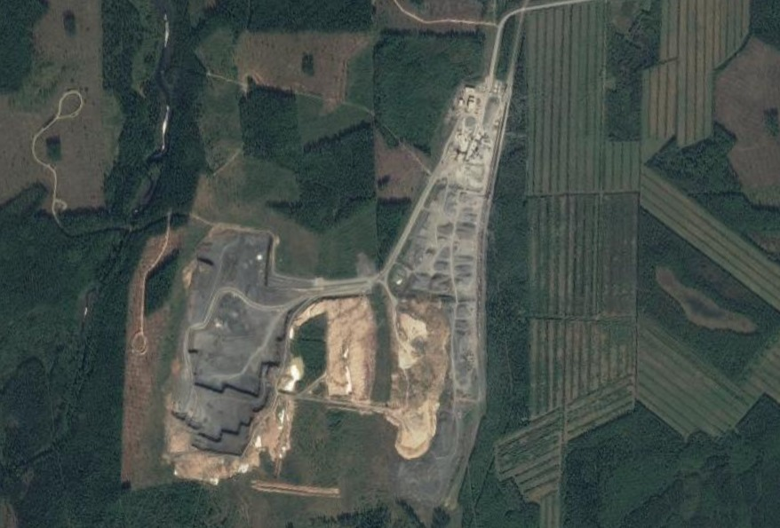
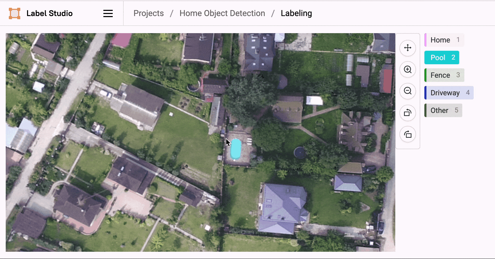
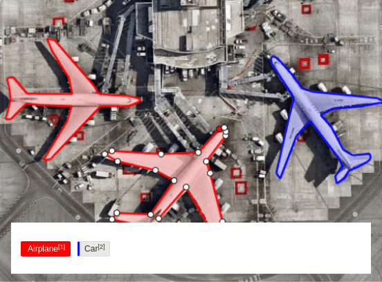
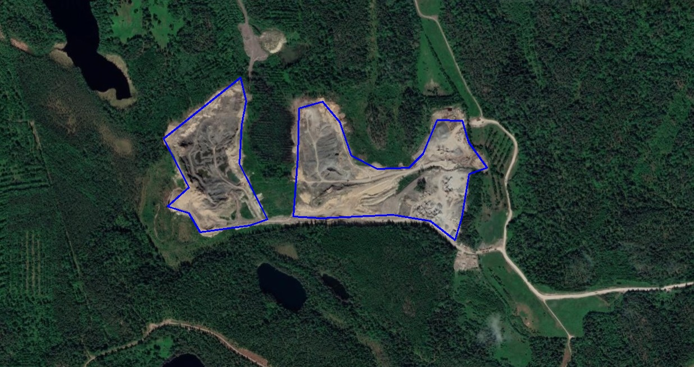
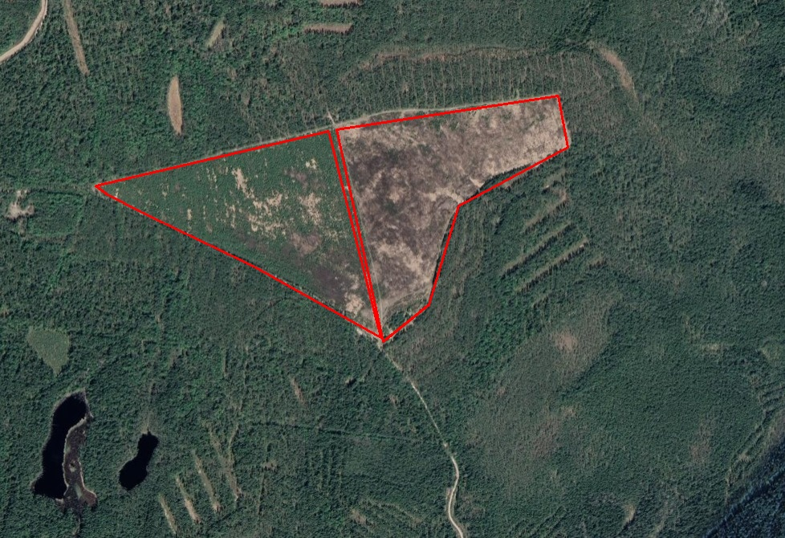
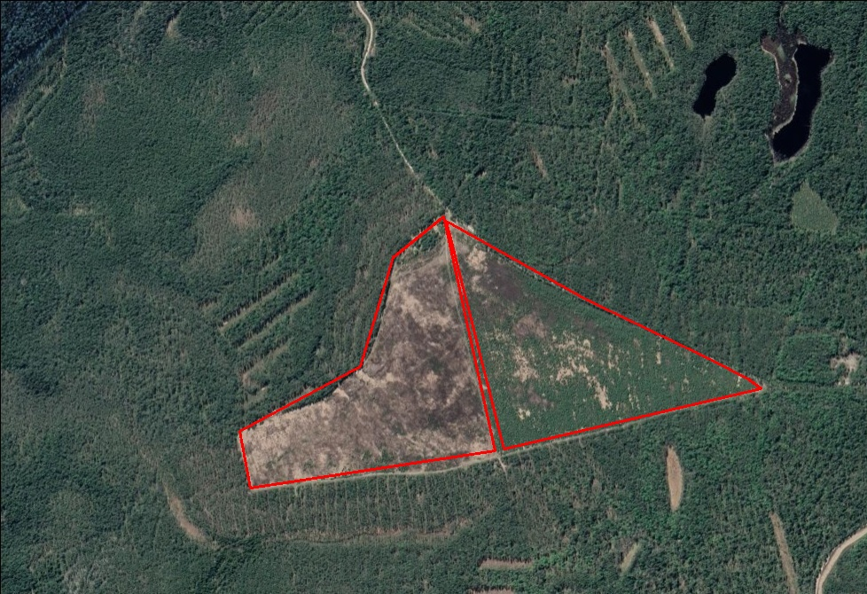

# Вклад студента Филиппова в разработку проекта ***"Алгоритмы по распознаванию карьеров, вырубок, участков используемои‌ пашни с помощью технологии‌ машинного обучения и компьютерного зрения на территории Ленинградской области"***

## Роль в команде
В команде я являюсь специалистом по машинному обучению и анализу данных. Однако по стечению обстоятельств мне пришлось взять на себя и некоторые задачи тимлидера. 
## Решенные задачи
### Сбор данных и разметка изображений
По скольку мы не смогли договориться с заказчиком кейса насчёт датасета, мне пришлось организовывать сбор спутниковых снимков буквально с сервисов ``Google Maps`` и ``Яндекс Карты``. С этим мне помог другой член нашей команды. Всего у нас получилось около сотни снимков, содержащих карьеры, вырубки и пашни. Снизу можете наблюдать типичный снимок из нашего датасета. 



Позже я самостоятельно этот датасет разметил при помощи программы ``Label Studio``. Эта программа позволяет создавать проекты по разметке, вести совместную работу, выделять несколько классов, и импортировать размеченные данные в нужные форматы. Выглядит работа примерно так, как представлено на этой гифке.



Отличие составляет лишь то, что я размечал на при помощи прямоугольников, а при помощи полигонов. Смысл в том, что мы отмечаем точками границы сущности. Как на картинке ниже.



В целом, разметка данных совсем не сложный процесс, но требует определенной усидчивости и терпения.

По итогу я получил архив, состоящий из двух папок ``images``, ``labels`` и ``.yaml`` файла. В одном из них преставлены сами изображения, а во втором текстовые файлы, со следующей структурой.

```txt
0 0.12101381423381671 0.08878504672897196 0.1198389228334884
1 0.24907697686960334 0.34345794392523366 0.2596509994725582 0.3855140186915888
2 0.4664318859303421 0.2780373831775701 0.4464587321247608 0.3901869158878505 0.47700590853329694
```

Каждая из строк собой означает какой-то объект класса. Первое число означает, какому конкретно классу принадлежит изображение: **0 - пашня**, **1 - карьер** или **2 - вырубка**. Оставшиеся числа в каждой строке означают точки на снимке -- границе сущности.

На изображении это может выглядеть так:



В файле `data.yaml` хранится служебная информация о датасете. В нашем случае он выглядит так:

```yaml
names:
- arable
- quarry
- deforestation
nc: 3
train: data/images/train
val: data/images/val
test: data/images/test
```

## Нормализация
Для лучшей сходимости модели я написал скрипт, который нормализует изображение методом ``min-max``. Вот его код на ``Python``
```python
def normalize_image(image_path, method='min_max'):
    image = cv2.imread(image_path)
    if method == 'min_max':
        a = np.min(image)
        b = np.max(image)
        normalized_image = (image - a) / (b - a)
    elif method == 'standard':
        mean = np.mean(image)
        std = np.std(image)
        normalized_image = (image - mean) / std
    else:
        raise ValueError("Недопустимый метод нормализации. Используйте 'min_max' или 'standard'.")
    
    return normalized_image
```
### Масштабирование
Для улучшения и убыстрения обучения модели я написал скрипт, который преобразует изображение к определенному разрешению
```python
def resize_images(image_path, target_size):
    image = cv2.imread(image_path)
    resized_image = cv2.resize(image, target_size, interpolation=cv2.INTER_CUBIC)
    return resized_image
```
### Аугментация данных

Так как снимков у нас не сказать, что много, я решил произвести ***аугментацию данных***.

***Аугментация данных*** – это процесс искусственного генерирования новых данных на основе существующих, который используется преимущественно для обучения новых моделей машинного обучения.

Для этого я написал скрипт на языке ``python``, который отражал бы изображения относительно побочной диагонали. Кроме того, необходимо было и сохранить разметку, что тоже добавило некоторых трудностей.

```python
def rotate_image_and_labels(image_path, label_path, image_dir, label_dir):

    image = cv2.imread(image_path)

    with open(label_path, 'r') as f:
        labels = [line.strip().split() for line in f]

    height, width, _ = image.shape

    M = np.float32([[-1, 0, width], [0, -1, height]])

    rotated_image = cv2.warpAffine(image, M, (width, height))

    rotated_labels = []
    for label in labels:
        class_id = label[0]
        rotated_points = []
        rotated_points.append(class_id)
        for x, y in zip(label[1::2], label[2::2]):
            new_x = 1 - float(x)
            new_y = 1 - float(y)
            rotated_points.extend([str(new_x), str(new_y)])
        rotated_labels.append(rotated_points)

    rand_string = generate_alphanum_random_string(8)
    new_image_path = image_dir + rand_string + ".jpg"
    cv2.imwrite(new_image_path, rotated_image)
    new_label_path = label_dir + rand_string + ".txt"
    with open(new_label_path, 'w') as f:
        for label in rotated_labels:
            f.write(' '.join(label) + '\n')

    print(f'Saved augmented data: {os.path.basename(new_image_path)}')
```

Так выглядит функция, которая отражает изображения. Для этого используются библиотеки `opencv` и `numpy`. При помощи афинных преобразований и специальной матрицы изображение отражается. А далее в цикле отражаются и размеченные точки.
| **Оригинал** | **Отраженное** |
|---| --- |
|  |  |

Кроме того, для тестирования я написал также небольшой скрипт, который по данным из файла с метками рисует на изображении границы объекта. Пример его работы вы можете увидеть выше, а вот его код на `python`

```python
def mark_polygon_on_image(image_path, points_file_path):
    image = cv2.imread(image_path)

    with open(points_file_path, 'r') as file:
        lines = file.readlines()

    for line in lines:
        print(line)
        coordinates = line.strip().split()
        class_id = int(coordinates[0])
        points = [[float(x) * image.shape[1], float(y) * image.shape[0]] for x, y in zip(coordinates[1::2], coordinates[2::2])]

        points = np.array(points, dtype=np.int32)

        if class_id == 0:
            color = (0, 255, 0)
        elif class_id == 1:
            color = (255, 0, 0)
        elif class_id == 2:
            color = (0, 0, 255)
        else:
            color = (255, 255, 255)

        cv2.polylines(image, [points], True, color, thickness=2)

    cv2.imwrite('output_image.jpg', image)
```
Пока в аугментации мы решили остановиться на отражении, но чисто технически можно еще осуществить отзеркаливание вокруг любой из осей, а также повороты.

### Поиск и тестирование модели

Кроме всех вышеуказанных задач, я еще нашел одну из моделей, которую можно использовать для распознавания объектов на спутниковых снимках. Это модель `YOLOv9`. Она довольно популярна среди людей увлекающихся компьютерным зрением. Результатом работы в этом направлении является [`Colab Notebook`](https://colab.research.google.com/drive/1FXGTrXsMRnsHpx90pBehAVdp3LbeWIKn?usp=sharing#scrollTo=XoV4sGOKJPZj). Модель совсем неплохо справляется определением карьеров, но есть проблемы с определением пашен и вырубок. Во многом это связано с тем, что пашни со спутника сильно похожи на вырубки. Да еще и датасет маловат, да и снимки не лучшего качества. 
### Задачи тимлида
На правах человека, который хотел сделать этот проект, мне пришлось мобилизовывать настоящего тимлида для того, чтобы он наконец-то завел трекер задач, а также эти самые задачи раздавать и пытаться напоминать, что их необходимо делать.
## Вывод
Большая часть проекта готова. Осталось написать ИАР, а также протестировать еще пару моделей для выбора наилучшей. К концу дедлайна по проекту я думаю, что мы управимся. 